#############
EdgeX Manager
#############

The Manager is the tool provided to easily control and monitor the EdgeX microservices.

Features of the Manager include:

* Viewing devices and performing control and configuration operations on them
* Visualizing data that is streamed from devices
* Setting up and monitoring schedules and events
* Creating and managing export services, i.e the recipients of the data from EdgeX
* Gathering and viewing logs produced by the EdgeX microservices
* Viewing, and where possible, configuring meta data within EdgeX

In addition, many of the commands described in the EdgeX documentation can be more easily performed by using the features of the Manager.

The Manager consists of a microservice and a web-based user interface application. The user interface requires that the microservice is already running.

This guide describes the use of the Manager with reference to the devices started by the virtual device service. For information about Virtual Device please refer to `EdgeX Virtual Device <https://docs.edgexfoundry.org/Ch-VirtualDevice.html>`_.

=========================
Starting the microservice
=========================

Add an entry to the docker-compose.yml to use IoTech's pre-built image:

::

  iotech-manager:
    image: docker.iotechsys.com/public/iotech-manager-java-x86_64:latest
    ports:
      - "8080:8080"
    container_name: iotech-manager
    hostname: iotech-manager
    networks:
      - edgex-network
    depends_on:
      - volume
      - metadata
      - data
      - command

===========================
Starting the User Interface
===========================

In a browser, navigate to localhost:8080, use Google Chrome or Chromium.  The Manager will connect and initially display the Devices view:

=======
Devices
=======

The Devices view will display all of the devices that are currently configured and running in EdgeX.  When the virtual device service is running (as described above), the simulated devices will be displayed similar to as follows:

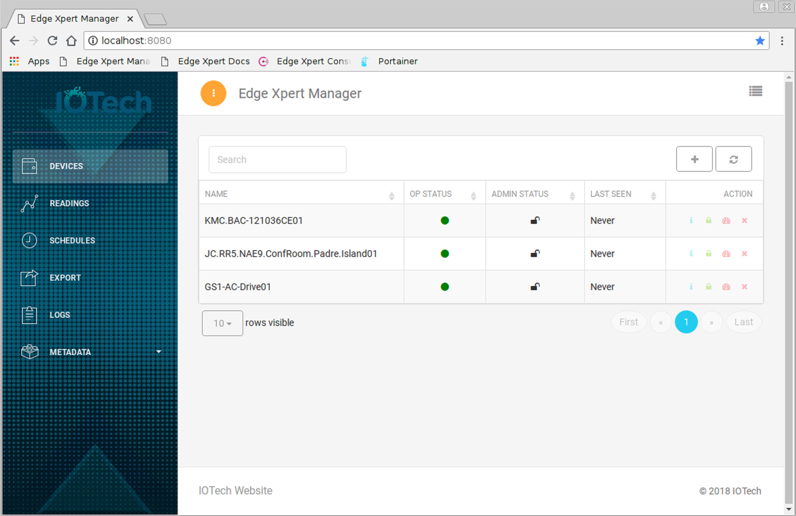

The Devices view includes the capability to search for particular devices and view properites of each device.  Device properties include its Operating State, Admin State (locked/unlocked) and the last time the device was connected.  The interface also allows for more detailed device information to be viewed, for the device to be locked or unlocked and for the device to be controlled as per its interface.  The Devices view also provides options to add new devices to EdgeX or delete them.

----------------
View Device Data
----------------

To view more detailed information for a specific device, click the "View Device" (i) icon in the device table.  This view shows device information such as its description, manufacturer, model etc as well as status and details of the Device Service to which it is associated. Use the scroll bar to see all data available.

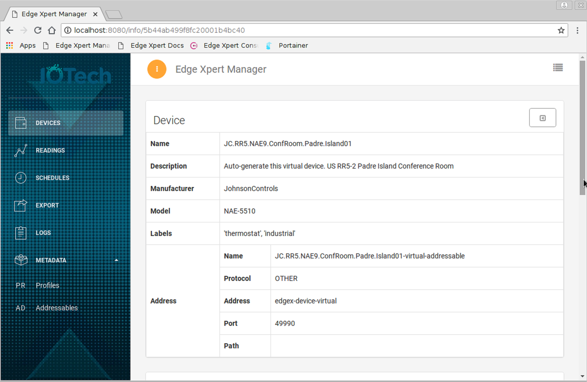

-----------------------
Lock or Unlock a Device
-----------------------

To lock or unlock a specific device, click the "Lock Device" (lock) icon in the device table.  The interface presents a confirmation screen for locking or unlocking the device.

----------------
Control a Device
----------------

To control the specifics of a device, click the "Control Device" (dial) icon in the device table.  The interface presents the configurable values that are defined by the device.  For example, for the "JC.RR5.NAE9.ConfRoom.Padre.Island01" virtual device:

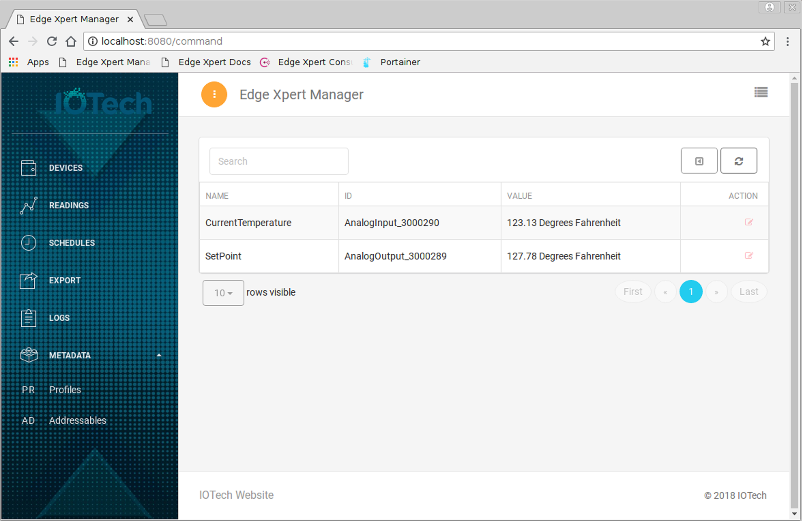

Then to set data for these values, the click the "Set Value" (write) icon.  For example, for the "JC.RR5.NAE9.ConfRoom.Padre.Island01" virtual device the Current Temperature's collection frequency could be changed as follows:

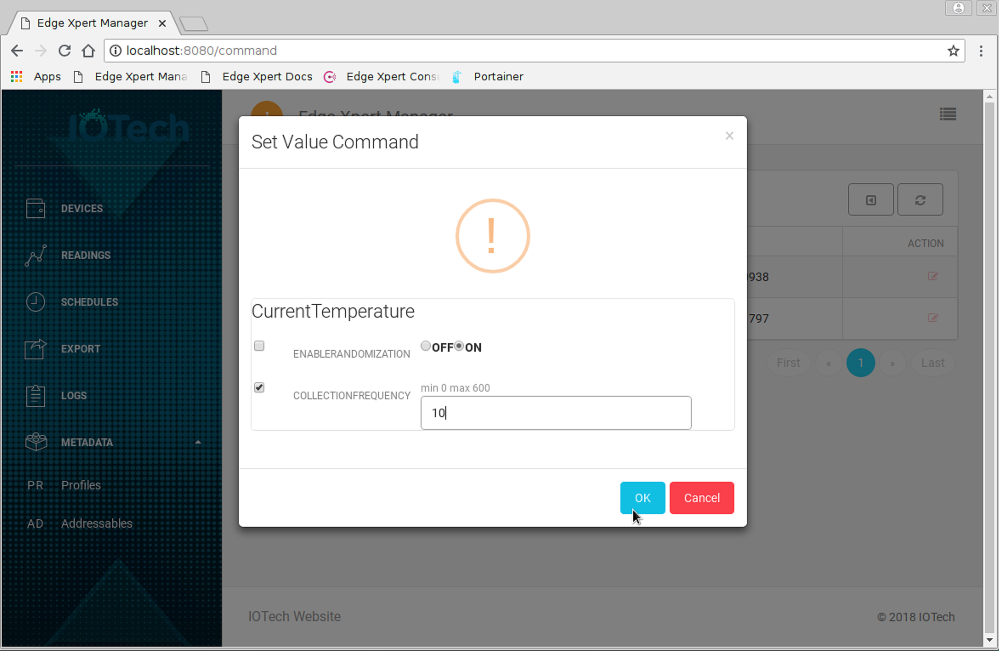

------------	   
Add a Device
------------

A new device can be added by clicking the "Add Device" (plus) icon on the devices pane.

---------------
Delete a Device
---------------

A device can be deleted by clicking the "Delete Device" (cross) icon in the device table.  The interface presents a confirmation screen for deleting the device.

========
Readings
========

The Readings view will display data from the devices selected by the user.  For easy visualization, the data is presented in both table and graph form.

As an example, if the user selects the "JC.RR5.NAE9.ConfRoom.Padre.Island01" virtual device, the following information is presented:

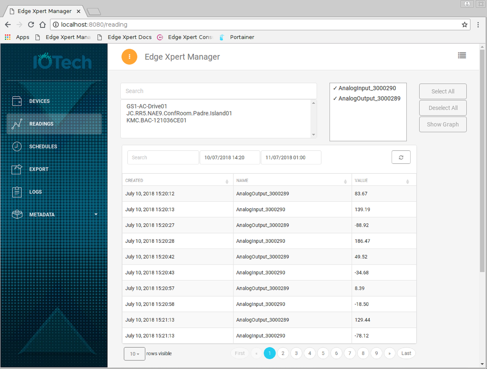

IThe same data can also be displayed in graph form by clicking the "Show Graph" button:

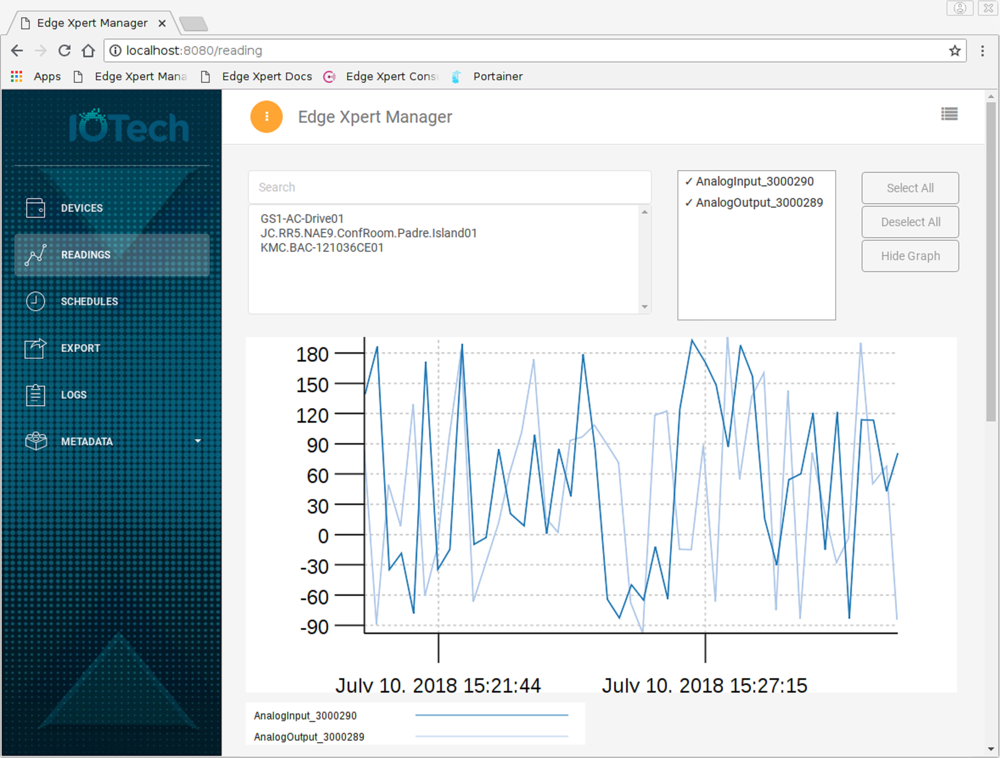

The user is able to search for specific readings and specify a time/date period for which the data should be displayed.

=========
Schedules
=========

The Schedules view allows for the visualization, creation and management of events scheduled in EdgeX.  For more information about Schedules please refer to `EdgeX Scheduling <https://docs.edgexfoundry.org/Ch-Scheduling.html>`_.

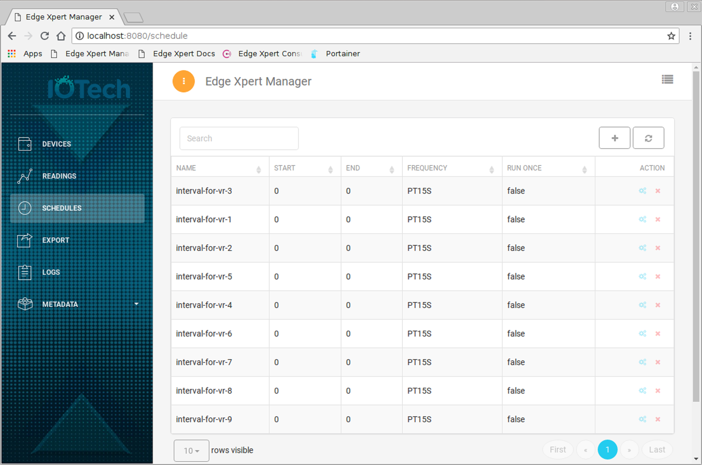

To view the schedules for a specific device, click the "Show Events" (cog) icon in the schedules table:

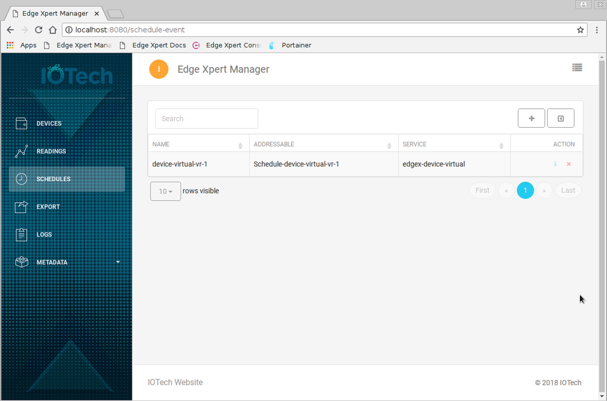

To view the details of a specific scheduled event, click the "View Scheduled Event" (info) icon in the events table:

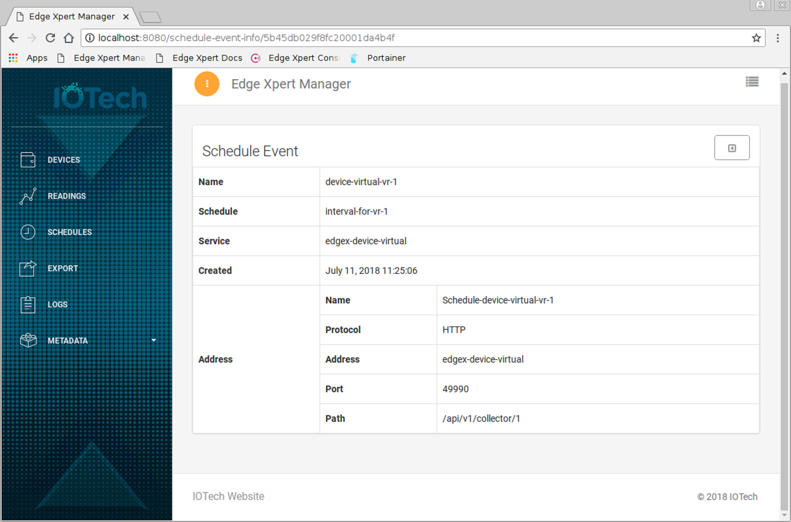

======
Export
======

The Export view allows for the visualization, creation and management of the recipients of data from EdgeX via Export Service.  For more information about Export Services please refer to `EdgeX Export Services <https://docs.edgexfoundry.org/Ch-ExportServices.html>`_

====
Logs
====

The Logs view presents items that are logged by the EdgeX microservices while they are running. These can be useful to verify and diagnose EdgeX behavior.  For information about Logging please refer to `EdgeX Logging <https://docs.edgexfoundry.org/Ch-Logging.html>`_

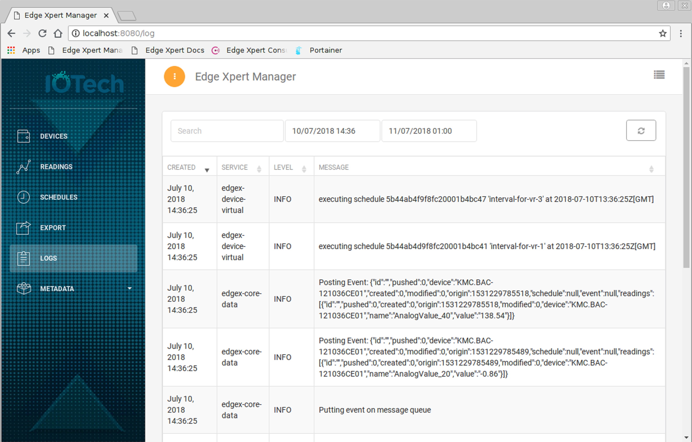

Again, the user is able to search for specific log items and specify a time/date period for which the log data should be displayed.

=========
Meta Data
=========

The Meta Data pages display information about the device data maintained within EdgeX.  For information about MetaData Profiles and Addressables please refer to `EdgeX MetaData <https://docs.edgexfoundry.org/Ch-Metadata.html>`_

--------	   
Profiles
--------

The Profiles view display information for each device usually defined in the device's associated YAML file.  For information about Device Profiles please refer to `EdgeX Device Profiles <https://docs.edgexfoundry.org/Ch-DeviceProfile.html>`_

With the virtual device service running (as described above), the profiles for the simulated devices will be displayed similar to as follows:

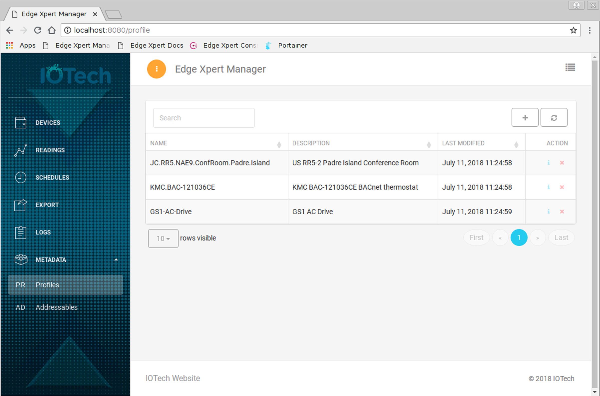

To view the profile for a specific device, click the "View Device" (info) icon in the profiles table.  Use the scroll bar to see all data available.

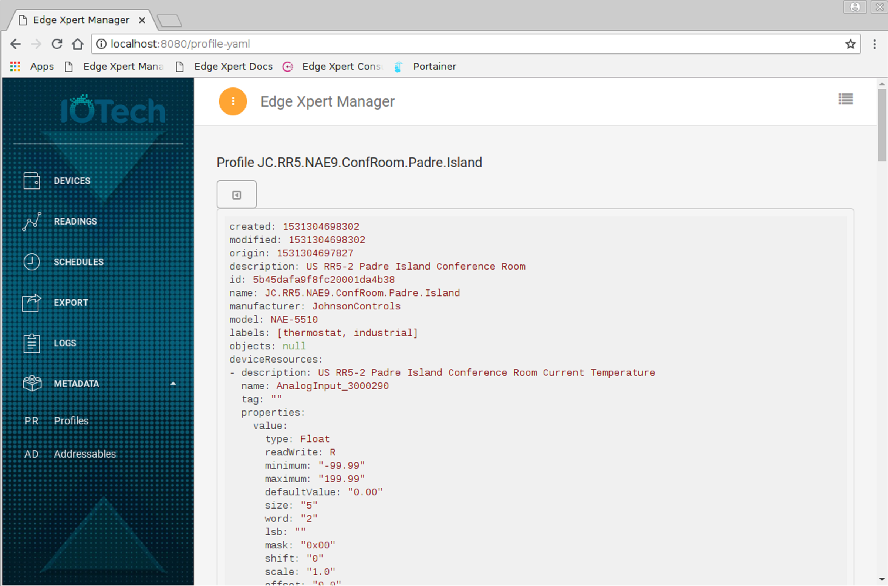

------------	   
Addressables
------------

An addressable is the metadata required to make a request to an EdgeX target.

With the virtual device service running (as described above), the addressables for the simulated devices will be displayed similar to as follows:

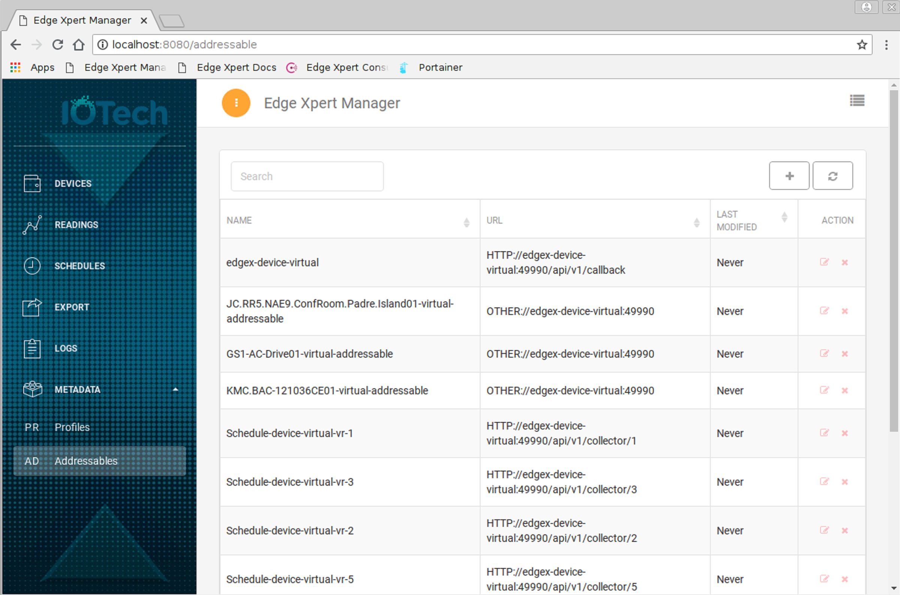

The Manager provides the capability to add, edit and delete EdgeX addressables.

===============
Troubleshooting
===============

The Manager contains a facility whereby the state of the tool can be captured and exported to a file. This data can be used by a developer to replay the user's actions and see the internal state of the tool. Please see the Fulcro documentation for more details.

